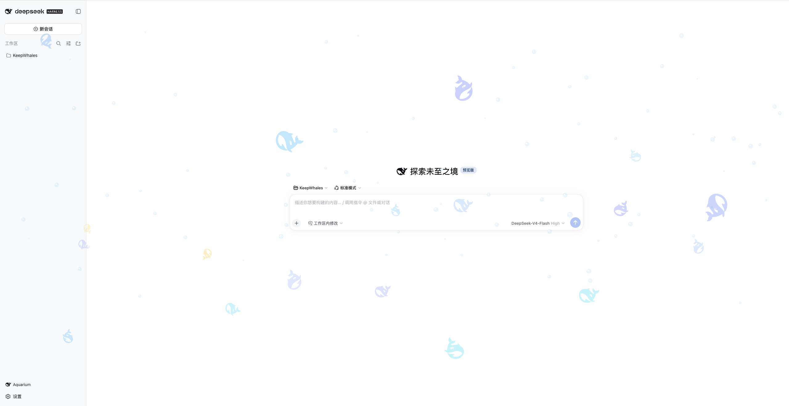

# 🐳 dsh-whale-aquarium

**给 DSH（DeepSeek Harness）Web 界面养一缸鲸鱼。**

一群 DSH 官方鲸鱼标志在你整个界面之上游动：鼠标靠近就加速躲开，点一下画面整群四散。图层完全穿透——不挡点击、不挡输入、不影响任何快捷键。

<!-- 截图：把你的界面截图放到 docs/images/aquarium.png，然后删掉下面这行的注释符

-->

> **非官方插件 · Unofficial plugin.** 与 DeepSeek 无关联、未获其授权或背书。
> Not affiliated with, authorized by, or endorsed by DeepSeek.

---

## 安装

一条命令，然后**重启** DSH：

```sh
dsh plugin --profile web add github:tulipdkw/dsh-whale-aquarium
```

```sh
# 装完后重启 web profile（不是刷新浏览器页面）
dsh web
```

重启后：侧边栏底部出现鲸鱼标志按钮，界面上开始有鲸群游动。

<details>
<summary>其他安装方式 / 卸载 / 前置条件</summary>

**从本地目录或 tarball**（自己改了代码想试）

```sh
git clone https://github.com/tulipdkw/dsh-whale-aquarium && cd dsh-whale-aquarium
dsh plugin --profile web add file:$PWD
```

**从前置条件说起**：`dsh plugin` 是把参数转发给 pnpm 执行的，所以需要机器上有 pnpm：

```sh
npm i -g pnpm        # 或 corepack enable pnpm
```

**确认装上了**

```sh
dsh plugin --profile web why dsh-whale-aquarium
dsh --profile web --dump-config | grep -n whale-aquarium
```

**更新到新版本**（从 GitHub 装的会重新解析到最新提交；改完一样要重启 profile）

```sh
dsh plugin --profile web update dsh-whale-aquarium
```

**卸载**（会把包和它的配置层一起撤掉）

```sh
dsh plugin --profile web remove dsh-whale-aquarium
```

浏览器里残留的设置可以顺手清掉：Console 执行 `localStorage.removeItem('dsh-whale-aquarium/v1')`。

</details>

## 使用

| 想做 | 在哪 |
| --- | --- |
| 一键开关水族箱 | 侧边栏底部的**鲸鱼标志按钮**（点击切换，开启时变主题色） |
| 调数量 / 体型 / 游速 / 透明度 | 设置 → **Whale Aquarium** |
| 调避险半径、气泡、混合模式、朝向 | 同上 |
| 逗鱼 | 鼠标靠近它们会躲；**点一下画面**整群四散 |

- **避险半径**：鼠标进入这个距离内鲸鱼就开始逃，默认 150px。
- **混合模式**：让鲸鱼与界面颜色做 `mix-blend-mode`，更融进背景，略耗性能，默认关。
- **朝向翻转**：万一鲸鱼看着像在倒着游，点一下即可。
- 设置存在浏览器 `localStorage`，**会记住**（不写进 DSH 配置，也不跨浏览器同步）。

## 常见问题

**装完没反应？**
必须**重启 profile**（`dsh web` 关掉重开），不是刷新浏览器页面。浏览器半的代码是在 profile 启动时读入并缓存的。

**鲸鱼浮在界面上面，不是真正的背景？**
是的，这是 DSH 目前的限制，不是 bug。原因和取舍写在 [docs/HOW-IT-WORKS.md](docs/HOW-IT-WORKS.md#为什么是浮在最上层)。默认 45% 透明度就是为此调的。

**觉得太吵？**
设置里把透明度降到 25% 左右，或把数量调到 4–6 条，基本就只剩氛围了。

**没有气泡？**
先看 设置 → Whale Aquarium 里 `Bubbles` 是不是被关掉了（这个开关会持久化，v0.1.2 起气泡本身也做得明显多了）。

**会不会拖慢界面？**
一个全屏 canvas，每帧重画一群矢量鲸鱼（默认 10 条 ≈ 750 段贝塞尔）——canvas2d 的常规负载。嫌吵就降数量/透明度，或者开混合模式让它更融入背景。

**兼容性**
在 DSH `0.1.2-rc.1` + macOS 上验证；只对 `web` profile 有意义（它是浏览器端插件）。

## 它是怎么做的

一句话：一个 npm 包，**宿主半是空的**，全部逻辑在浏览器半——用 DSH 官方的鲸鱼标志路径（含官方那两套游动姿态）画在一个 `shell.overlay` 浮层的 canvas 上，只往三个**增量插槽**里注册，不替换任何出厂 UI。

技术细节（包结构、`dsh.bundle` / `dsh.client` 双面契约、插槽选择、性能取舍）在 [docs/HOW-IT-WORKS.md](docs/HOW-IT-WORKS.md)；
测试与发布流程在 [docs/MAINTAINING.md](docs/MAINTAINING.md)。

## 许可与致谢

MIT，见 [LICENSE](LICENSE)。

鲸鱼标志及其两套官方游动姿态来自 DeepSeek Harness 的开源客户端包（`@deepseek-ai/dsh-client-ui-primitives`、`@deepseek-ai/dsh-client-ui-conversation`，同为 MIT）。标志本身是 DeepSeek 的品牌资产，本项目按官方 [BRAND_GUIDELINES.md](https://github.com/deepseek-ai/deepseek-harness/blob/master/BRAND_GUIDELINES.md) 使用：项目名只用推荐的缩写 "DSH"、不冒用完整商标、并明确声明非官方。

版本历史见 [CHANGELOG.md](CHANGELOG.md)。

---

## English

**A whale aquarium for the DSH (DeepSeek Harness) web UI.** A school of the official DSH whale mark swims over the whole frame, flees your cursor, and scatters when you click. The layer is fully click-through.

```sh
dsh plugin --profile web add github:tulipdkw/dsh-whale-aquarium
dsh web   # restart the profile (a page reload is not enough)
```

Toggle it from the whale-mark button at the sidebar foot; tune it under **Settings → Whale Aquarium** (count, size, speed, opacity, shyness radius, bubbles, blend mode, facing). Settings persist in `localStorage` and are not written to DSH config.

It uses the official whale mark paths — including the two official swim poses DSH itself renders — on a single `shell.overlay` canvas, and registers only additive slots. No build step: `lib/*.js` is the shipped artifact.

Unofficial plugin, not affiliated with or endorsed by DeepSeek. MIT licensed.
